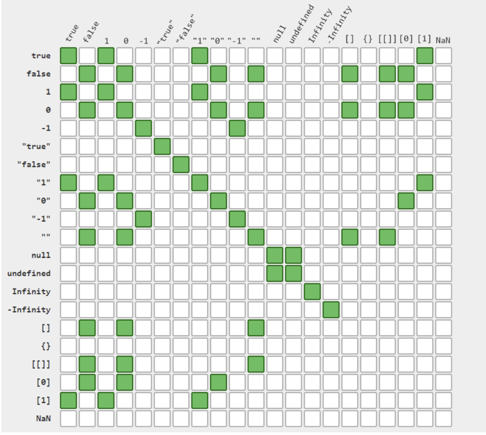
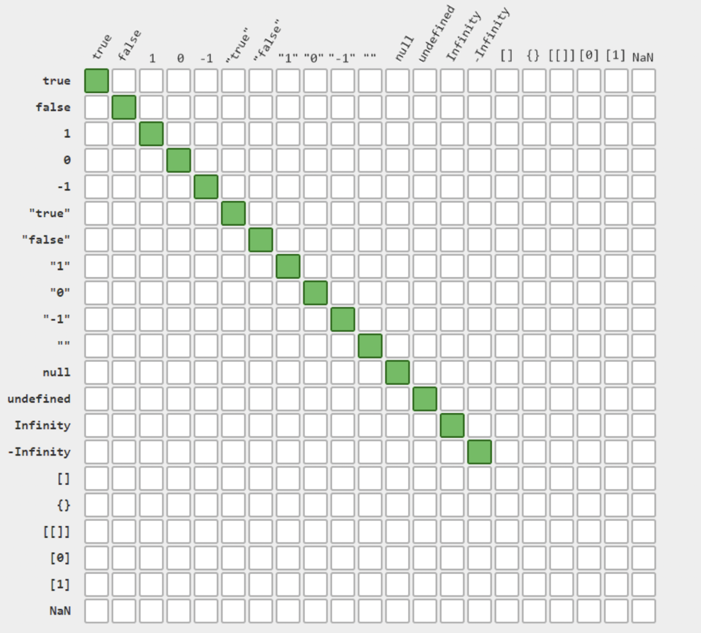

(Primitive coercion)[https://developer.mozilla.org/en-US/docs/Web/JavaScript/Data_structures#primitive_coercion]
### Equality `==` vs `===` Comparison Operator
(See operators)[https://dorey.github.io/JavaScript-Equality-Table/]
#### Loose Equality

#### Strict Equality

```javascript
/* In this example "22" will be converted to 22
* and true will be converted to 1
* As 22 is not equal to 1 this evaluates to false */
"22" == true // false
```
### `valueOf` and `toString`
```javascript
/* toPrimitive -> valueOf -> toString */
+"113" // will be converted to a number 113 
```
### Bitwise operations
[See link](https://www.w3schools.com/js/js_bitwise.asp)  
Javascript uses *addition to 2* to store negative numbers 
Change all 1 to 0, and 0 to 1, and then add 1 to this number  
Bitwise operators will work only with integers, they separate the integer
part from the comma values.  
`&` **and** sets each bit to 1 if boths bits are 1  
`|` **or** sets each bit to 1 if one of two bits is 1  
`^` **xor**, sets each bit to 1 if only one of two bits is 1
   sometimes used in cryptography. 
  `data ^ xor = data_changed`  
  `data_changed ^ xor = data`  
  chat example: xor can be used with a private key to secure messages  
  and covert those messages back to data when received  
`~` **not**, inverts all the bits  
`<<` **left shift**, zero fill left shift, shift left by pushing 
  zeros in from the right and let the leftmost bits fall off  
`>>` **right shift**,  Signed right shift,  shift right by pushing copies
of the leftmost bit in from the left, and let the rightmost bits fall off.  
`>>>` zero fill right shift, shift right by pushing zeroes in 
from the left, and let the rightmost bits fall off.
### ?? and || 
```javascript
a ?? b // if a is null or undefined return b, else retur na
a || b // convert values to boolean, and return values a or b
```
### Bigint
For numbers there is a special constant called `MAX_SAFE_INTEGER`.  
This is not the max integer, but it's risky to perform operations
beyond this value.
If bigger numbers are needed use **Bigint**.
```javascript
BigInt(2) // 2n
42n == 42 // true
42n === 42 // false
0n // false
```
## Functions
It's an object of type `function`.  
But this object can be called with `fun()`.    
How does a function declaration look like?  
```javascript
function doSomething(parameter) {}
```
Whe can use `functions expressions` to define fucntions
```javascript
// using an anonimous functions
const doSomething = function (parameter) {}
// or a named function expression
const doAnother = function doAnother(parameter) {}
```
Named functions can be useful when an error occurs 
Or when we need to call a function recursively
#### Arrow functions
Is a more compact expression, but it has its difficulties
```javascript
const doSomething = foo => {}
```
we can use **default parameters**
```javascript
const doAnother = (foo = 1, bar = 2) => {}
```
#### Function context
`fun.call(newContext, ..args)`   
`fun.apply(newContext, [...args])`  
#### Return
If a function returns no value, it will return `undefined`
#### Advanced
Functions can be defined inside other functions
```javascript
function test() {
  function innerTest() {
    return 'inner test'
  }
  // ...
}
```
#### Arrow vs Named Functions
```javascript
const car = {
  brand: 'Citroen',
  start: function () {
    console.log('starting engine ' + this.brand)
  },
  stop: () => {
    console.log('stopping engine ' + this.brand)
  }
}
car.start() // started engine Citroen
car.stop() // stopping undefined
```
Arrow functions context uses the global function
Don't use arrow functions when handling events in web dom
#### Call function immediately
```javascript
(function test() {})()
```
#### Hoisting Functions
Functions are totally hoisted, meaning moving them to the top of the file.  
This avoids having undefined undefined functions

#### OOP
Inheritance, Polymorphism, Encapsulation.  
Javascript can't achieve encapsulation in oop.  
This is why **closure** was created.  
```javascript
const bark = dog => {
 const say = dog + ' barked!' // private variable
 return say
}
console.log(bark('sparkie'))
bark.say // can not be accessed
```
Conversion like classes in babel
```javascript
const prepareBark = dog => {
 const say = dog + " barked"
 return () => say
}
const barkRoger = prepareBark('Roger')
console.log(barkRoger()) // Roger barked
```

#### Functional Programming
Pure Functions properties
* Idempotent, always return the same value if the same arguments are provided
* Shouldn't generate other events
```javascript
// Idempotent but with side effect (non pure)
function isMale(user) {
 if (user.sex === 'man') {
  males += 1
  return true
 }
 females += 1
 return false
}
```
**Crankshaft** can see if a function is pure or not,
and if the function is pure it will be **cached**  
##### High order functions
Should take one or more functions as an argument, and return a function
as a result. Like *map* or *forEach*
##### Function caching
```javascript
function fibbonacci() {}

function cache(fn) {
  const cache = {}
  
  return function cachedFn(n) {
    if (!cache[n]) {
      let result = fn(n)
      cache[n] = result
    }
    
    return result
  }
}
const fibCached = cache(fibbonacci)
```
Caching only works for pure functions

See lazy function and curring
